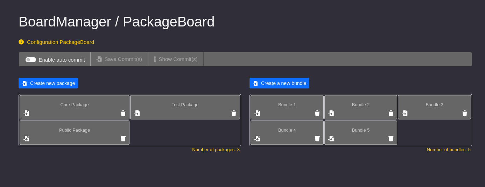
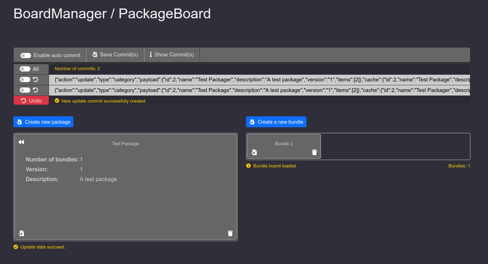

# BoardManager - Modular Vanilla JS Management Dashboard


## What this application is

BoardManager is a small prototype web application with two dynamic boards: a **Category board** and an **Item board**.

## Category ↔ Item relation

Categories and items can be created, edited, and removed at runtime.  
A category can contain multiple items.  
When you open a category, the item board can switch to show only the items linked to that category.

## Commit workflow (offline changes + revert)

The application also provides a **Commit mode**.  
In this mode, changes are stored locally as commits instead of being applied immediately.

You can:
- create multiple commits while working “offline”,
- review the commit list,
- revert commits one by one in waterfall order (step-by-step),
- submit all pending commits as a batch when you are ready.

### Default Screen
 
<br>

### Editmode Screen
  


---

## Testing

This project uses **Vitest**, a blazing fast unit test framework built on Vite, to ensure code quality and reliability.

### Quick Start

```bash
# Install dependencies
npm install

# Run all tests
npm run test:run

# Run tests in watch mode
npm test

# Open interactive UI dashboard
npm run test:ui

# Generate coverage report
npm run test:coverage
```

### Test Files

All unit tests are located in `public/js/app/__tests__/` and mirror the structure of the source code. Tests cover the core utility and helper modules used throughout the application.

### Running Tests Locally

- **Watch Mode:** `npm test` - Tests re-run automatically when files change
- **Single Run:** `npm run test:run` - Runs all tests once and exits
- **Interactive Dashboard:** `npm run test:ui` - Opens a visual test explorer in your browser
- **Coverage Report:** `npm run test:coverage` - Generates an HTML coverage report

For more information about Vitest, visit [vitest.dev](https://vitest.dev/).

---

## Key Features

- **Pure Vanilla JS:** No framework dependencies, full control over the DOM.
- **Event-Driven Architecture:** Communication via a central Event Bus (Pub/Sub pattern).
- **Modular MVC:** Clear separation between data (Store), logic (Controller), and presentation (View).
- **Dynamic Form Generation:** Automated creation of UI forms based on JSON schemas.
- **State Management:** Centralized stores with data normalization and type safety.
- **Responsive Design:** Integrated with Bootstrap 5.3.
- **Commit System:** Flexible data persistence with support for both real-time updates and manual batch commits.
- **Comprehensive Testing:** Unit tests for core modules using Vitest.
- **Interactive UI Dashboard:** Visual test explorer for interactive testing.
- **Code Coverage Report:** HTML coverage report for code coverage analysis.
---

## Data Persistence & Commit System

The BoardManager implements a robust commit system to manage how data changes are sent to the backend. This system provides users with two distinct modes of operation:

### 1. Automatic Commits (Real-time)
When the "Commits automatisch speichern" (Automatic Commits) switch is **enabled**:
- Every data operation (Adding, Updating, or Removing items/categories) is processed immediately.
- The system bypasses the local commit queue and prepares the data for instant backend synchronization.
- Users receive immediate feedback via the message system once the operation is successful.

### 2. Manual Batch Commits
When the "Commits automatisch speichern" switch is **disabled**:
- **Commit Queueing:** All changes are temporarily stored in the `CommitStore`.
- **UI Feedback:** A notification bar (`.commit-ctrl`) appears automatically as soon as there is at least one uncommitted change in the queue.
- **Batch Processing:** Users can continue making multiple changes (e.g., editing several items).
- **Manual Submit:** By clicking "Neuen Commit speichern", all queued changes are sent to the backend in a single batch operation.
- **Queue Management:** Upon successful submission, the `CommitStore` is cleared, and the notification bar is hidden.

### Technical Implementation
- **`CommitStore`:** Acts as a local buffer for pending changes.
- **`CommitController`:** Orchestrates the logic between the UI switch, the store, and the event bus.
- **Event-Driven:** The system uses the central `EventBus` to listen for `commit:add` events emitted by data controllers, ensuring a decoupled architecture.

---

## Architecture & Patterns

The project follows a strict modular structure:

### 1. Core Layer (`public/js/app/core/`)
The application's base infrastructure provides the glue between components:
- **EventBus.js:** A central Pub/Sub system that enables decoupled communication between different modules (e.g., notifying a Store when a Controller action occurs).
- **DomEventManager.js:** A specialized utility for handling DOM events efficiently, ensuring clean event binding and delegation.
- **Api.js:** Automated component initialization and data import logic.
- **Modal & ModalAdapter:** A decoupled modal system for user interaction, abstracting Bootstrap's modal logic.
- **Form.js / Dom.js / Validator.js:** Helper classes for DOM manipulation, form serialization, and input validation.
- **Utils.js:** General purpose utility functions used across the application.

### 2. State Layer (`State/`)
Keeps UI-related state and view modes (no persistence):
- **BoardState / CommitState:** Store UI state such as the current view/mode, selections, and UI flags.

### 3. Store Layer (`Store/`)
Manages data integrity, normalization, and persistence-related state:
- **AbstractStore:** Base class for all data operations, including a `schema`-based `normalize` process that ensures data (e.g., from the DOM) is correctly cast (Strings to Numbers, etc.).
- **ItemStore / CategoryStore / CommitStore:** Concrete stores for managing application resources and queued changes.
- **CategoryItemMapStore:** Store for mapping relations between categories and items.

### 4. Controller Layer (`Controller/`)
The bridge between View and State/Store:
- **AbstractController:** Contains DRY (Don't Repeat Yourself) logic for standard actions such as `add`, `edit`, `delete`, and `modalForm`.
- **Specific Controllers:** Inherit from AbstractController and implement individual business logic (e.g., linking items to categories).

### 5. View Layer (`View/`)
Responsible for rendering:
- **BoardView:** Utilizes HTML templates (`<template>`) to display data efficiently and reactively in the UI, responding to state/store changes.

---

## Installation & Local Development

### Prerequisites
Since the project uses ES modules, a local web server is required (security policies for the `file://` protocol prevent modules from loading).

### Step-by-Step Instructions

1. **Clone the repository:**
   ```bash
   git clone https://github.com/YOUR_USERNAME/BoardManager.git
   cd BoardManager
   ```

2. **Start a web server:**
   You can use any web server you prefer. Here are a few examples:

    - **PHP (built-in):**
      ```bash
      php -S localhost:8000
      ```
    - **Python:**
      ```bash
      python3 -m http.server 8000
      ```
    - **Node.js (http-server):**
      ```bash
      npx http-server
      ```

3. **Open your browser:**
   Navigate to `http://localhost:8000`.

---

## Project Structure

```text
BoardManager/
├── public/
│   ├── js/
│   │   ├── app/
│   │   │   ├── component/
│   │   │   │   └── BoardManager/      # Main component
│   │   │   │       ├── Controller/    # Business logic
│   │   │   │       ├── State/         # Ui state
│   │   │   │       ├── Store/         # Data stores
│   │   │   │       ├── View/          # UI rendering
│   │   │   │       ├── Factory/       # UI Component factories
│   │   │   │       └── Service/       # Helper services (IDs, Templates)
│   │   │   ├── core/                  # Base framework (EventBus, DOM, etc.)
│   │   │   └── App.js                 # Entry point
│   ├── css/                           # Styling (App & Bootstrap)
│   └── data/                          # JSON data sources
├── index.html                         # Entry page with HTML templates
└── README.md
```